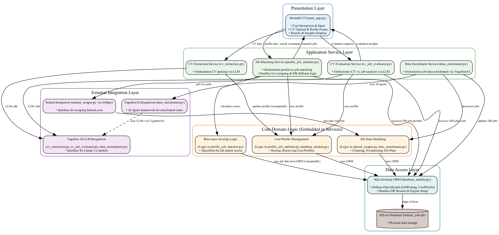
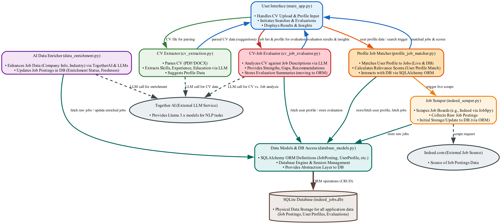

# 🎯 SkillScopeJob - AI-Powered Career Intelligence Platform

[](https://python.org)
[](https://streamlit.io)
[](https://together.ai)
[](https://sqlite.org)

**SkillScopeJob** is an advanced AI-powered career intelligence platform that combines CV analysis, job market intelligence, and personalized career recommendations to help professionals make data-driven career decisions.

---
**🐳 Docker Deployment Available!**

For easy deployment, a `docker_image` branch is available with pre-configured Docker setups. This allows you to run both the main application and the admin dashboard in isolated containers.

➡️ **[View Docker Deployment Guide on the `docker_image` branch](https://github.com/JAdamHub/SkillScopeJob/blob/docker_image/README.md)**

---

## 🌟 Features

### 🤖 AI-Powered CV Analysis
- **Intelligent CV Parsing**: Extract skills, experience, and qualifications from PDF, DOCX, and TXT files
- **Auto-Fill Profile Forms**: Automatically populate user profiles from CV data
- **Multi-Model Support**: Choose from various LLM models (Llama 3.2, Llama 3.1, Mixtral)
- **Contact Information Extraction**: Parse names, emails, phone numbers, and LinkedIn profiles

### 🔍 Real-Time Job Market Intelligence
- **Live Job Scraping**: Real-time job data from Indeed using python-jobspy
- **Intelligent Job Matching**: AI-powered relevance scoring and job-profile matching
- **Multi-Source Search**: Live scraping with database fallback for reliability
- **Location-Aware Search**: Support for all Danish municipalities and remote work preferences

### 📊 Advanced Analytics & Evaluation
- **CV-Job Compatibility Analysis**: Deep AI analysis of CV fit against specific job requirements
- **Match Scoring**: Comprehensive scoring system with strengths, gaps, and recommendations
- **Career Improvement Plans**: Personalized AI-generated development recommendations
- **Automated Data Enrichment**: Intelligent job enhancement with company insights, skill categorization, and industry analysis
- **Smart Database Maintenance**: Automatic data freshness tracking and cleanup for optimal performance

### 🎨 Modern User Experience
- **Interactive Streamlit Interface**: Beautiful, responsive web application
- **Real-Time Progress Tracking**: Live updates during job searches and analysis
- **Export Capabilities**: Download results in multiple formats (Markdown, Text, CSV)
- **Admin Dashboard**: Comprehensive job scraping and database management tools

## 🏗️ Architecture

SkillScopeJob follows a layered architecture with clean separation of concerns:

### Layered Architecture Overview


### Component Interaction Diagram


*Architecture diagrams are automatically generated using the `src/skillscope/utils/system_architecture.py` script*

### 📁 Project Structure

```
SkillScopeJob/
├── README.md                          # Project overview and setup instructions
├── requirements.txt                   # Python dependencies  
├── .env.example                       # Environment variables template
│
├── src/                              # Main source code
│   └── skillscope/                   # Main package
│       ├── core/                     # Core business logic
│       │   ├── cv_extraction.py      # LLM-based CV parsing engine
│       │   ├── cv_job_evaluator.py   # AI-powered CV evaluation system
│       │   ├── profile_job_matcher.py # Job matching and search logic
│       │   └── data_enrichment.py    # Data enrichment services + cleans jobs that are 30+ days from database
│       ├── models/                   # Database models and schemas
│       │   └── database_models.py    # SQLAlchemy ORM models
│       ├── scrapers/                 # Data collection modules
│       │   └── indeed_scraper.py     # Job scraping with python-jobspy
│       ├── ui/                       # User interface components
│       │   ├── main_app.py           # Main Streamlit application
│       │   └── admin_app.py          # Admin dashboard for job management
│       └── utils/                    # Utility functions
│           └── system_architecture.py # Architecture visualization tools
│
├── data/                             # Data files and databases
│   ├── databases/
│   │   └── indeed_jobs.db           # SQLite database
│   ├── ontologies/
│   │   ├── skill_ontology.csv       # Standardized skills database
│   │   └── roles_industries_ontology.csv # Job roles and industries
│   ├── logs/                        # Application logs
│   │   └── advanced_user_profile_log.csv # User profile activity logs
│   └── cache/                       # Temporary cache files
│
├── assets/                          # Static assets
│   └── images/                      # Architecture diagrams
│
├── scripts/                         # Automation and deployment
│   └── setup_database.py           # Database initialization
│
├── admin/                          # Administrative tools
└── docs/                          # Project documentation
```

## 🚀 Installation

### Prerequisites
- Python 3.10 or higher
- pip package manager
- Together AI API key (for AI features)

### Quick Setup

1. **Clone the repository**
   ```bash
   git clone https://github.com/JAdamHub/SkillScopeJob.git
   cd SkillScopeJob
   ```

2. **Setup**
   ```bash
   # Create virtual environment
   python3 -m venv venv
   source venv/bin/activate  # On Windows: venv\Scripts\activate
   
   # Install dependencies
   pip install -r requirements.txt
   
   # Set up environment variables
   cp .env.example .env
   # Edit .env with your Together API key
      TOGETHER_API_KEY=your_together_ai_api_key_here

   # Initialize database
   python scripts/setup_database.py

   # Note on dynamic files:
   # Directories like data/databases/, data/logs/, data/cache/ and files 
   # such as indeed_jobs.db and advanced_user_profile_log.csv 
   # are created dynamically by the application or setup scripts if they do not exist.
   ```

### Getting a Together AI API Key ($1.00 USD for free at sign-up)

1. Visit [together.ai](https://together.ai)
2. Sign up for an account
3. Navigate to the API section
4. Generate a new API key
5. Copy and place in .env file under: TOGETHER_API_KEY=your_together_ai_api_key_here

## 📖 Usage

### 🛍️ Main Application

Launch the main career intelligence platform from the project root folder:

```bash
python launch_main_app.py
```

Access the application at `http://localhost:8501` (or the port specified in `launch_main_app.py` if different)

### 🧑🏽‍✈️ Admin Dashboard

Launch the job scraping and management dashboard from the project root folder:

```bash
python launch_admin_app.py
```

Access the admin panel at `http://localhost:8502` (or the port specified in `launch_admin_app.py` if different)

### Core Workflows

#### 1. CV Analysis & Profile Creation
1. Upload your CV (PDF, DOCX, or TXT)
2. Configure AI model and API key
3. Let AI auto-extract and populate your profile
4. Review and customize the extracted information
5. Save your professional profile

#### 2. Job Search & Matching
1. Define job search keywords and preferences
2. Set location and remote work preferences
3. Run intelligent job search with live scraping
4. Review AI-scored job matches with relevance ratings
5. Export results for further analysis

#### 3. CV-Job Evaluation
1. Select top 10-jobs from your matches
2. Run comprehensive AI analysis
3. Get detailed compatibility scores
4. Review strengths, gaps, and recommendations
5. Generate personalized improvement plans

#### 4. Data Management (Admin)
1. Configure job search parameters
2. Run batch job scraping operations
3. Monitor database statistics
4. Export job data for analysis

#### 5. Data Enrichment (Automated & Manual)
1. **Automatic Enrichment**: Job data is automatically enriched after live scraping
2. **Manual Enrichment**: Use the admin dashboard for on-demand enrichment
3. **Company Intelligence**: Enhanced job postings with company size, industry, and insights
4. **Skill Categorization**: Intelligent skill extraction and categorization from job descriptions
5. **Database Maintenance**: Automatic data freshness tracking and cleanup

### Data Enrichment Features

The integrated data enrichment system provides:

- **🤖 Automatic Processing**: Runs automatically after job scraping in the main application
- **🎛️ Manual Controls**: Available through the admin dashboard with customizable batch sizes
- **📊 Real-time Status**: Live monitoring of enrichment progress and database health
- **🏢 Company Intelligence**: Enhanced job data with company information and industry insights
- **🔧 Smart Maintenance**: Automatic database cleanup and optimization
- **📈 Progress Tracking**: Detailed metrics on enrichment completion and data quality

## 📊 Architecture Diagrams

The project includes automatically generated architecture diagrams that provide visual representations of the system structure and component interactions.

### Generating Architecture Diagrams

To regenerate the latest architecture diagrams:

```bash
# Navigate to project root
cd /path/to/SkillScopeJob

# Run the architecture generator
python src/skillscope/utils/system_architecture.py
```

This will create/update the following diagrams in `assets/images/`:
- `skillscope_layered_architecture.png` - Shows the layered architecture with all components
- `skillscope_component_interaction.png` - Illustrates how components interact with each other
- `skillscope_dual_interface.png` - Shows the main user and admin interfaces and their interactions
- `skillscope_data_flow.png` - Visualizes the enhanced data flow through the system
- `skillscope_file_architecture.png` - Provides a detailed file-based architecture view
- `skillscope_technology_stack.png` - Outlines the key technologies used
- `skillscope_module_dependencies.png` - Shows module import relationships
- `skillscope_user_journey.png` - Illustrates the user's journey through the application
- `skillscope_system_overview.png` - A comprehensive overview of all system parts

### Requirements for Diagram Generation

- **Graphviz**: Required for PNG generation
  ```bash
  # macOS
  brew install graphviz
  
  # Ubuntu/Debian
  sudo apt-get install graphviz
  
  # Windows
  # Download from https://graphviz.org/download/
  ```

- **Python Dependencies**: Already included in `requirements.txt`
  - `graphviz` (Python package)

### Viewing Diagrams Online

If Graphviz is not installed, the script will generate `.dot` files that can be viewed online at [GraphvizOnline](https://dreampuf.github.io/GraphvizOnline/).

## 🔧 Configuration

### Environment Variables

| Variable | Description | Required |
|----------|-------------|----------|
| `TOGETHER_API_KEY` | Together AI API key for LLM services | Yes |

### Model Configuration

The application supports multiple AI models:

- **meta-llama/Llama-3.2-90B-Vision-Instruct-Turbo** (Recommended)
- **meta-llama/Llama-3.1-70B-Instruct-Turbo**
- **meta-llama/Llama-3.1-8B-Instruct-Turbo**
- **mistralai/Mixtral-8x7B-Instruct-v0.1**

### Database Configuration

The application uses SQLite by default. The database file (`indeed_jobs.db`) is created automatically in the project root.

## 🔌 API Reference

### Core Components

#### CV Extraction (`src/skillscope/core/cv_extraction.py`)
```python
from skillscope.core.cv_extraction import LLMCVExtractor

extractor = LLMCVExtractor(api_key="your_key", model="llama-model")
result = extractor.extract_from_file("path/to/cv.pdf")
```

#### Job Matching (`src/skillscope/core/profile_job_matcher.py`)
```python
from skillscope.core.profile_job_matcher import run_profile_job_search

results = run_profile_job_search(profile_data)
```

#### CV Evaluation (`src/skillscope/core/cv_job_evaluator.py`)
```python
from skillscope.core.cv_job_evaluator import CVJobEvaluator

evaluator = CVJobEvaluator()
evaluation = evaluator.evaluate_cv_against_specific_jobs(user_id, jobs, profile)
```

#### Job Scraping (`src/skillscope/scrapers/indeed_scraper.py`)
```python
from skillscope.scrapers.indeed_scraper import scrape_indeed_jobs

job_count = scrape_indeed_jobs("python developer", "copenhagen, denmark")
```

### Database Models

The application uses SQLAlchemy ORM with the following main models:

- **UserProfile**: User career profiles and preferences
- **JobPosting**: Scraped job postings from Indeed
- **UserJobMatch**: Job-profile matching results
- **CVJobEvaluation**: CV evaluation results

## 🛠️ Development

### Setting Up Development Environment

1. **Create virtual environment**
   ```bash
   python -m venv venv
   source venv/bin/activate  # On Windows: venv\Scripts\activate
   ```

2. **Install development dependencies**
   ```bash
   pip install -r requirements.txt
   pip install pytest black flake8  # Additional dev tools
   ```

3. **Run tests**
   ```bash
   python -m pytest tests/  # If test directory exists
   ```

### Code Structure Guidelines

- **Presentation Layer**: Streamlit applications for user interfaces
- **Business Logic**: Core career intelligence and matching algorithms  
- **AI Services**: LLM integration and intelligent analysis
- **Data Layer**: Database models and data access patterns
- **External APIs**: Integration with job boards and AI services

### Contributing

1. Fork the repository
2. Create a feature branch (`git checkout -b feature/amazing-feature`)
3. Commit your changes (`git commit -m 'Add amazing feature'`)
4. Push to the branch (`git push origin feature/amazing-feature`)
5. Open a Pull Request

## 📊 Key Technologies

### Core Stack
- **Frontend**: Streamlit with custom components
- **Backend**: Python with asyncio support
- **Database**: SQLite with SQLAlchemy ORM
- **AI/ML**: Together AI LLMs + for data enrichment

### Major Dependencies
- **streamlit**: Web application framework
- **together**: Together AI SDK for LLM integration
- **python-jobspy**: Job scraping from Indeed
- **sqlalchemy**: Database ORM
- **langchain**: LLM application framework
- **plotly**: Interactive visualizations
- **pandas**: Data manipulation and analysis

### External Services
- **Together AI**: Large Language Model services
- **Indeed.com**: Job posting data source

## 🚨 Troubleshooting

### Common Issues

#### CV Upload Fails
- Verify Together AI API key is set correctly
- Check file format (PDF, DOCX, TXT supported)
- Ensure file is not corrupted or password-protected
- Try a different AI model if extraction fails

#### Job Search Returns No Results
- Check internet connectivity
- Verify job search keywords are not too specific
- Try broader location criteria
- Check if Indeed is accessible from your region

#### Database Errors
- Ensure write permissions in project directory
- Check if SQLite database file is not corrupted
- Try reinitializing database with `init_database()`

### Error Messages

#### `ImportError: No module named 'together'`
Install the Together AI SDK: `pip install together`

#### `API key not found`
Set your Together AI API key in environment variables or directly in the application.

## 📄 License

This project is licensed under the MIT License.
